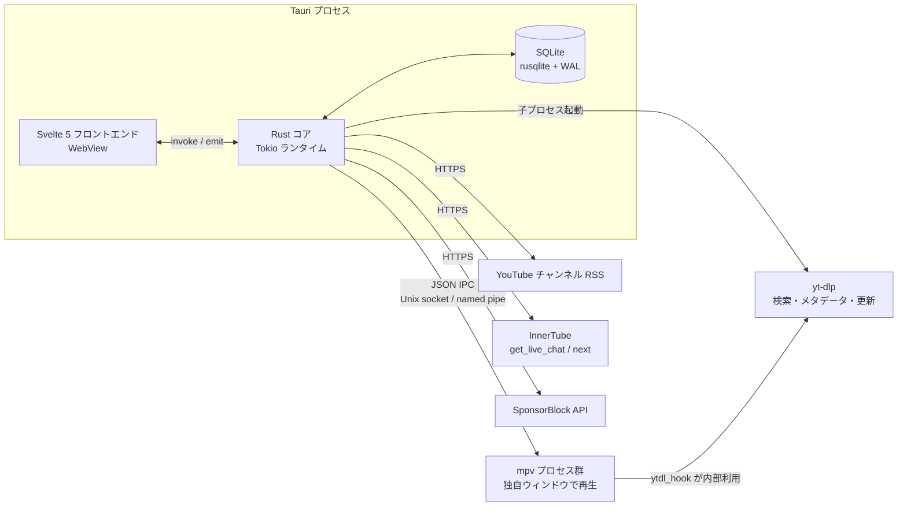

# yt-browser 設計書

[requirements-definition.md](requirements-definition.md) に基づく概要設計と詳細設計。
確定済みの判断は「仕様決定 A」などの ID で [decision-records.md](decision-records.md) を参照する。

## 1. システムアーキテクチャ

### 1.1 全体構成



要点は「動画再生と UI の分離」にある。
mpv は独自ウィンドウで再生し、Rust コアは IPC で操縦だけを担う（仕様決定 B）。
WebView の描画パイプラインに動画を通さないため、WebKitGTK の GL 統合やプラットフォーム差に左右されない。

### 1.2 プロセスとタスクのモデル

- **WebView スレッド**：UI の描画と入力だけを持ち、重い処理は持たせない
- **Tokio ワーカー群**：mpv IPC の読み取りと書き込み、RSS ポーラー、チャットポーラー、yt-dlp 起動をタスクとして動かす
- **DB 接続**：rusqlite は同期 API なので、`Mutex<Connection>` を 1 本持ち、書き込みは短いトランザクションに収める
  書き込み量が少ない用途のため接続プールは持たない。
- **mpv プロセス**：1 再生につき 1 プロセス 1 IPC ソケットとし、マルチビューはインスタンスを増やすだけで済む
- **yt-dlp**：都度起動の短命プロセスとし、常駐させない

## 2. モジュール構成

`src-tauri` 以下の Rust 側を、責務ごとのモジュールに分ける。

| モジュール | 責務 |
|---|---|
| `commands` | Tauri の invoke ハンドラ。入力検証と UI 向けの直列化に徹する |
| `mpv` | プロセス起動、ソケット管理、JSON IPC クライアント、プロパティ監視 |
| `yt` | yt-dlp 子プロセスの呼び出し層。検索、動画情報、チャンネル動画一覧（`YoutubeBackend` トレイト抽象化は現状未導入。§9.2） |
| `feed` | チャンネル RSS のポーラー。新着の検出と未読への積み上げ |
| `innertube` | ytcfg の取得と InnerTube への POST。`chat` と `related` が共用する |
| `chat` | get_live_chat ポーラーと renderer → `ChatEvent` への正規化 |
| `filter` | NG フィルタのモデルと、Aho-Corasick / RegexSet によるマッチャ |
| `sponsor` | SponsorBlock API クライアントとスキップ判定 |
| `db` | 接続、マイグレーション、クエリ |
| `model` | `Video`、`ChatEvent`、`FeedItem` などの共通型 |

依存方向は `commands` → 各モジュール → `db` / `model` の一方向に揃え、モジュール間の直接参照を避ける。

## 3. IPC 設計（Tauri コマンドとイベント）

### 3.1 コマンド（フロント → Rust）

| コマンド | 引数 | 戻り値 |
|---|---|---|
| `play_video` | `video_id`, `resume` | `Result<instance_id>` |
| `player_control` | `instance_id`, `action`（pause / resume / seek / volume / speed / quality / frame_step / frame_back_step） | `Result<()>` |
| `player_close` | `instance_id` | `Result<()>` |
| `subscribe_channel` | `input`（UC ID・channel URL・`@handle`）, `category_id?` | `Result<Channel>` |
| `unsubscribe_channel` / `list_channels` / `set_channel_category` | `channel_id`, `category_id?` | `Result<()>` / `Vec<Channel>` |
| `list_categories` / `create_category` | `name` | `Vec<Category>` / `Result<Category>` |
| `list_feed` | `filter`（未読のみ、カテゴリ、期間） | `Vec<FeedItem>` |
| `mark_read` | `video_ids` または `all` | `Result<()>` |
| `feed_refresh` | `channel_id?` | `Result<()>` |
| `block_channel` / `unblock_channel` / `blocked_channels` | `channel_id`, `title` | `Result<()>` / `Vec<BlockedChannel>` |
| `search` | `query` | `Vec<SearchResult>` |
| `get_related` | `video_id` | `Vec<SearchResult>` |
| `chat_start` / `chat_stop` | `video_id` | `Result<()>` |
| `chat_history_search` | `video_id?`, `query`, `limit` | `Vec<ChatEvent>` |
| `filter_add` / `filter_remove` / `filter_list` | `Filter` または `id` | `Result<()>` / `Vec<Filter>` |
| `history_list` / `playlist_*` / `settings_get` / `settings_set` | 略 | 略 |

`play_video` の `video_id` は URL 各形式（`watch?v=`、`youtu.be/`、`/shorts/`、`/live/`、`/embed/`）と裸の動画 ID の両方を受け取り、サーバ側で正規化する。
`play_video` が返す `instance_id` が制御対象の識別子で、UI はアクティブな窓の ID を保持して全操作に付ける。
単一再生でも必須引数に揃え、マルチビュー時の操作経路を初期から担保する（FR-1）。
`player_control` に操作を集約するのは、mpv 側への転送層を一箇所に保つためである。
頻繁に増減するイベント型の操作をコマンド名で細分化しない。

### 3.2 イベント（Rust → フロント）

| イベント | ペイロード | 発火条件 |
|---|---|---|
| `player://state` | `{ instance_id, pause, position, duration, fps, state }` | observe_property の変化を間引いて発火 |
| `player://ended` | `{ instance_id, reason }` | 終了またはエラー |
| `feed://new_items` | `{ count }` | ポーラーが新着を検出 |
| `feed://status` | `{ channel_id?, level, message }` | 取得失敗と復帰 |
| `chat://message` | `Vec<ChatEvent>` | 正規化済みイベントのバッチ（送信は 4〜10Hz に間引く） |
| `chat://status` | `{ video_id, level, message }` | ポーラーの劣化と停止 |
| `sponsor://skipped` | `{ video_id, category, segment }` | 自動スキップ発火 |

`player://state` は mpv の `time-pos` 変化をそのまま横流しするとイベント洪水になるため、200〜500ms 間隔でサンプリングして送る。

## 4. 動画再生サブシステム

### 4.1 mpv の起動と制御

mpv を子プロセスとして起動し、`--input-ipc-server` でソケットを開かせる。
ソケットは Linux が Unix ドメインソケット、Windows が名前付きパイプになる。

```text
mpv --idle=yes
    --input-ipc-server=<runtime_dir>/mpv-<instance>.sock
    --ytdl=yes
    --ytdl-format=<設定値>
    --hr-seek=yes
    --cache=yes
    --hwdec=auto-safe
    --keep-open=yes
    --script=<app_data>/mpv/wheel.lua
    --script-opts=ytdl_hook-ytdl_path=<yt-dlp のパス>
```

`ytdl_path` を明示するのは、同梱 yt-dlp とシステム yt-dlp が混在する環境でどちらが使われるかを確定させるためである。

送受信の例。

```json
{"command": ["loadfile", "https://www.youtube.com/watch?v=XXXX", "replace"]}
{"command": ["set_property", "pause", true]}
{"command": ["seek", 30.5, "absolute"]}
{"command": ["frame-step"]}
{"command": ["frame-back-step"]}
{"command": ["observe_property", 1, "time-pos"]}
{"command": ["observe_property", 2, "pause"]}
{"command": ["observe_property", 3, "duration"]}
{"command": ["observe_property", 4, "video-params"]}
```

監視するプロパティは `time-pos`、`duration`、`pause`、`eof-reached`、`media-title`、`paused-for-cache`、`video-params`（fps 表示用）、`volume`、`speed`。
受信側は 1 ソケットにつき 1 読み取りタスクを持ち、`event` 行を購読者に振り分ける。

### 4.2 コマ送り

`frame-step` と `frame-back-step` はデコード単位の移動なので、秒数換算や fps 推定を伴わず、丸め誤差が原理的に発生しない[^drift]。
逆向き移動は `hr-seek=yes` を前提とし、デコード済みバッファが浅いソースでは最初の 1 回だけ遅延し得る点を仕様として明記する。

ホイールの条件分岐は mpv の input 機構に属するため、アプリ同梱の Lua スクリプトで実装する。

```lua
-- wheel.lua: 一時停止中はコマ送り、再生中は音量
local function wheel(ev, paused_cmd, playing_delta)
  -- ホイールのノッチは複合バインドでは press として届く
  if ev.event ~= "press" and ev.event ~= "down" then return end
  if mp.get_property_bool("pause") then
    mp.command(paused_cmd)
  else
    mp.commandv("add", "volume", playing_delta)
  end
end
mp.add_key_binding("WHEEL_UP",   "yb_wheel_up",   function(e) wheel(e, "frame-step",      2) end, {complex=true})
mp.add_key_binding("WHEEL_DOWN", "yb_wheel_down", function(e) wheel(e, "frame-back-step", -2) end, {complex=true})
```

アプリ側 UI ボタンとキーバインドは `player_control` 経由で同じコマンドを叩く。
割り当ての既定は仕様決定 D、変更は `settings` 経由で Lua スクリプト側に反映する方法を Phase 2 で確定する[^wheelconf]。

[^drift]: yt-frame-scrub で発生した「`currentTime * fps` の丸めによる着地ずれ」はシークでフレームに寄せる方式固有の問題であり、mpv のコマ送りはデコーダが 1 フレーム進める方式のため推定自体を行わない。
[^wheelconf]: 単純な実装は mpv 起動オプションの `--script-opts` で挙動を渡す方式で、起動中に変えるには Lua 側で `options` を読み直すかスクリプトメッセージで差し替える。

### 4.3 画質選択

画質は `ytdl-format` の式で表現する。
設定にはプリセットと自由記述の両方を用意する。

| プリセット | 式 |
|---|---|
| 1080p 上限 | `bv*[height<=1080]+ba/b[height<=1080]` |
| 1080p60 優先 | `bv*[height<=1080][fps>30]+ba/bv*[height<=1080]+ba/b[height<=1080]` |
| AV1 優先 | `bv*[vcodec^=av01][height<=1080]+ba/bv*[vcodec^=vp9][height<=1080]+ba/b[height<=1080]` |
| 最高画質 | `bv*+ba/b` |

変更は `set_property ytdl-format` + `loadfile ... replace` で再生中に適用する。

### 4.4 SponsorBlock（技術方針 N）

`GET https://sponsor.ajay.app/api/skipSegments?videoID=<id>&categories=[...]` を再生開始時に取得する。
`time-pos` の監視で現在位置が区間 `[start, end)` に入ったら `seek` で `end` に飛ばし、`sponsor://skipped` を発火する。
スキップはアプリ側の責務に寄せるため、mpv 側の SponsorBlock スクリプトには依存しない。
カテゴリごとの「スキップ / 通知のみ / 無効」は設定で持つ。

### 4.5 PiP とマルチビュー

マルチビューは mpv インスタンスを複数立てるだけで成立する。
PiP は mpv を `--ontop --no-border --geometry=WxH+X+Y` で小窓起動したものを指す。
アプリのウィンドウにはピクセルを持ち込まないので、WebView との合成は発生しない。

## 5. yt-dlp の呼び出し（技術方針 P）

用途はメタデータ取得と検索で、ストリーム解決そのものは mpv の `ytdl_hook` に委譲する。

| 用途 | 呼び出し |
|---|---|
| 動画詳細 | `yt-dlp -J <url>` |
| 検索 | `yt-dlp "ytsearch<N>:<query>" --dump-json --flat-playlist`（行単位の JSONL をストリーム的に読む） |
| チャンネル一覧の補完 | `yt-dlp <channel_url> --flat-playlist --dump-json` |

運用上の論点を次に置く。

- **更新機構**：暫定案は同梱バイナリ＋アプリ内更新ボタン＋起動時の定期チェックで、システムインストール優先のフォールバックも設計に含める
  最終選択は未決事項として Phase 1 で確定する（要件定義 §8）
- **JS ランタイム**：YouTube 解読に Deno 等を要求する環境では、同梱 Deno か手順ドキュメントで補う（Phase 1 時点の要件で確定）
- **PO Token**：必要になる環境向けに、外部プロバイダの設定手順をドキュメント化する
- **失敗の扱い**：タイムアウト、非ゼロ終了、JSON パース失敗を区別して記録し、解析失敗は生の先頭部分をログに残す

## 6. InnerTube クライアントとチャットパイプライン

### 6.1 共有の土台

`innertube` モジュールは watch ページから `INNERTUBE_API_KEY`・`INNERTUBE_CONTEXT_CLIENT_VERSION`・`VISITOR_DATA` を一度だけ取得してキャッシュし、`post_json` を提供する。
このクライアントをチャットポーラーと関連動画取得（`next`）が共用する。

`next` 応答の関連動画は、2026-10 時点の WEB クライアントでは `lockupViewModel`（`contentType == LOCKUP_CONTENT_TYPE_VIDEO`）で返る。
パーサーは旧来の `compactVideoRenderer` / `videoWithContextRenderer` も併せてキー名で再帰探索し、レイアウト差分に耐える。
各フィールドの対応は、`contentId` → 動画 ID、`metadata.lockupMetadataViewModel.title.content` → タイトル、`metadataRows[0]` → チャンネル名、`metadataRows[1]` 先頭 → 短縮表記の再生数、アバター内 `browseEndpoint.browseId` → UC チャンネル ID、サムネイルオーバーレイの `thumbnailBadgeViewModel.text` → 動画長、とする。

### 6.2 チャットポーラー（仕様決定 F）

1. watch ページ HTML の `ytInitialData` から `liveChatRenderer.continuations` の初期継続トークンを得る
2. `POST /youtubei/v1/live_chat/get_live_chat?key=<apiKey>` に `context.client` と継続トークンを渡す
3. 応答の `actions[]` を `ChatEvent` に正規化し、`continuations[0].timeoutMs` だけ待って次を投げる
4. エラー時は指数バックオフ、終了時は継続トークンが消えるためループを抜ける

主な renderer の写像は次の通り。

| renderer | ChatEvent.kind |
|---|---|
| `liveChatTextMessageRenderer` | `text` |
| `liveChatPaidMessageRenderer` / `liveChatPaidStickerRenderer` | `superchat` |
| `liveChatMembershipItemRenderer` | `membership` |
| `markChatItemAsDeletedAction` 相当 | `deleted` |
| その他 | `other`（raw_json を保持） |

### 6.3 NG と保存のパイプライン

受信した `ChatEvent` は「NG 判定 → DB 保存 → UI 送信バッファ」の順に流す。
保存は NG に関わらず原文を残し、UI 側の表示だけをフィルタで制御する。
これにより「ログは完全・表示は絞る」専ブラの基本線を保つ。

保存は 1 メッセージごとの `INSERT` を逐次実行せず、ポーラー内部で数秒または数百件単位のトランザクションに束ねる。

## 7. NG フィルタエンジン（技術方針 M）

フィルタのモデルは `target`（`video_title` / `video_desc` / `channel_title` / `channel_id` / `chat_text` / `chat_author`）× `kind`（`literal` / `regex`）の組み合わせで、評価対象から独立した判定器にする。

- literal はパターン集合を Aho-Corasick で 1 回走査
- regex は `RegexSet` でプリコンパイルし、ヒットした集合だけ個別 `Regex` で詳細を取る
- フィルタ変更時にマッチャ全体を再構築する単純な方式にし、増分更新は行わない

チャンネルブロックはこのエンジンとは別に `blocked_channels` テーブルで扱い、クエリの `NOT IN` と、検索や関連の結果に対する後段フィルタで適用する（仕様決定 E）。

## 8. データベース設計（技術方針 K）

```sql
PRAGMA journal_mode = WAL;
PRAGMA foreign_keys = ON;

CREATE TABLE categories (
  id INTEGER PRIMARY KEY AUTOINCREMENT,
  name TEXT NOT NULL,
  sort_order INTEGER NOT NULL DEFAULT 0
);

CREATE TABLE channels (
  channel_id TEXT PRIMARY KEY,             -- UC... 形式
  title TEXT NOT NULL,
  thumbnail_url TEXT,
  category_id INTEGER REFERENCES categories(id) ON DELETE SET NULL,
  subscribed_at TEXT NOT NULL DEFAULT (datetime('now')),
  last_polled_at TEXT,
  rss_etag TEXT,
  rss_last_modified TEXT
);

CREATE TABLE blocked_channels (
  channel_id TEXT PRIMARY KEY,
  title TEXT NOT NULL,
  created_at TEXT NOT NULL DEFAULT (datetime('now'))
);

CREATE TABLE videos (
  video_id TEXT PRIMARY KEY,
  channel_id TEXT NOT NULL,
  channel_title TEXT,
  title TEXT NOT NULL,
  thumbnail_url TEXT,
  published_at TEXT,
  duration_sec INTEGER,
  kind TEXT NOT NULL DEFAULT 'video'
    CHECK (kind IN ('video','short','live','upcoming')),
  is_read INTEGER NOT NULL DEFAULT 1,      -- フィード由来の新着のみ 0 で入る
  first_seen_at TEXT NOT NULL DEFAULT (datetime('now'))
);

CREATE TABLE watch_history (
  video_id TEXT PRIMARY KEY,
  title TEXT NOT NULL,
  channel_id TEXT,
  channel_title TEXT,
  position_sec INTEGER NOT NULL DEFAULT 0,
  duration_sec INTEGER,
  last_watched_at TEXT NOT NULL DEFAULT (datetime('now')),
  completed INTEGER NOT NULL DEFAULT 0
);

CREATE TABLE favorites (
  video_id TEXT PRIMARY KEY,
  added_at TEXT NOT NULL DEFAULT (datetime('now'))
);

CREATE TABLE playlists (
  id INTEGER PRIMARY KEY AUTOINCREMENT,
  name TEXT NOT NULL,
  sort_order INTEGER NOT NULL DEFAULT 0
);

CREATE TABLE playlist_items (
  playlist_id INTEGER NOT NULL REFERENCES playlists(id) ON DELETE CASCADE,
  video_id TEXT NOT NULL,
  position INTEGER NOT NULL,
  PRIMARY KEY (playlist_id, video_id)
);

CREATE TABLE chat_logs (
  id INTEGER PRIMARY KEY AUTOINCREMENT,
  video_id TEXT NOT NULL,
  posted_at_usec INTEGER NOT NULL,
  author_channel_id TEXT,
  author_name TEXT,
  kind TEXT NOT NULL DEFAULT 'text'
    CHECK (kind IN ('text','superchat','membership','deleted','other')),
  message TEXT NOT NULL,
  amount_display TEXT,
  raw_json TEXT NOT NULL
);

CREATE VIRTUAL TABLE chat_logs_fts USING fts5(
  message, author_name, content='chat_logs', content_rowid='id'
);

CREATE TABLE filters (
  id INTEGER PRIMARY KEY AUTOINCREMENT,
  target TEXT NOT NULL CHECK (target IN
    ('video_title','video_desc','channel_title','channel_id','chat_text','chat_author')),
  kind TEXT NOT NULL CHECK (kind IN ('literal','regex')),
  pattern TEXT NOT NULL,
  enabled INTEGER NOT NULL DEFAULT 1,
  created_at TEXT NOT NULL DEFAULT (datetime('now'))
);

CREATE TABLE settings (
  key TEXT PRIMARY KEY,
  value TEXT NOT NULL
);

CREATE TABLE schema_migrations (
  version INTEGER PRIMARY KEY,
  applied_at TEXT NOT NULL DEFAULT (datetime('now'))
);
```

```sql
CREATE INDEX idx_videos_channel_pub ON videos(channel_id, published_at DESC);
CREATE INDEX idx_videos_unread ON videos(is_read, published_at DESC);
CREATE INDEX idx_history_recent ON watch_history(last_watched_at DESC);
CREATE INDEX idx_chat_video_ts ON chat_logs(video_id, posted_at_usec);

CREATE TRIGGER chat_logs_ai AFTER INSERT ON chat_logs BEGIN
  INSERT INTO chat_logs_fts(rowid, message, author_name)
  VALUES (new.id, new.message, new.author_name);
END;
CREATE TRIGGER chat_logs_ad AFTER DELETE ON chat_logs BEGIN
  INSERT INTO chat_logs_fts(chat_logs_fts, rowid, message, author_name)
  VALUES ('delete', old.id, old.message, old.author_name);
END;
```

設計上の注意を三点置く。

- `videos` は購読フィード由来の「未読管理を持つ一覧」と、視聴やお気に入りで登場した動画の双方を載せる最小の台帳とする
  検索や関連の結果は揮発データとして DB に積まない。
- チャット検索は FTS5 の外部コンテンツ方式で本文と投稿者名を対象にし、削除は `chat_logs` 側の行削除に連動させる
- 履歴とログの保持は無期限を既定とし、手動削除のみとする（仕様決定 I）

## 9. エラーハンドリングと変更耐性

### 9.1 エラー型の棲み分け（技術方針 L）

モジュールごとに thiserror の enum（`MpvError`、`YtError`、`ChatError`、`DbError` 等）を持ち、`commands` 層で anyhow に畳み込んで UI には `{ code, message }` に直列化して返す。
ポーラー系の長命タスクは anyhow で文脈を積み、連続失敗回数を `feed://status` / `chat://status` の劣化通知に変換する。

### 9.2 YouTube 仕様変更への構造

- ストリーム解決と検索は `yt` モジュール内の関数群（`resolve`・`search` 等）の向こうに隔離し、yt-dlp 実装の破損は更新で追従する（トレイト抽象化は第 2 の実装やテスト差し替えが必要になった時点で導入する。現状は未導入）
- InnerTube の自前実装は `get_live_chat` と `next` に限定し、パーサーは保存した応答 JSON の golden fixture で回帰テストする（技術方針 O）
- 仕様変更時に UI 側が壊れないよう、`chat` / `related` / `feed` の各劣化状態は独立したステータスとして UI に出す

### 9.3 ログ

`tracing` + ローリングファイル出力を標準とし、リリースビルドは INFO、開発は DEBUG を既定にする。
レスポンス原文の保存はデバッグ用途に限定し、継続トークンなど再送可能な値はマスクしてから残す（golden fixture も同様に匿名化する）。

## 10. セキュリティと権限

- WebView は `csp` を既定 `default-src 'self'`、サムネイル表示のために `img-src https://i.ytimg.com https://*.ggpht.com` だけを許可する
- 外部リンクは WebView 内遷移ではなくシステムブラウザに開く
- アカウント連携を持たないため Cookie やトークンの保存は発生しない（仕様決定 H）

## 11. リポジトリ構成

```text
yt-browser/
  AGENTS.md / README.md / LICENSE
  docs/
  src-tauri/
    Cargo.toml
    src/
      main.rs
      commands/
      mpv/            # プロセス管理・IPC・プロパティ監視
      yt/             # yt-dlp 呼び出し層（バックエンド差し替え面）
      innertube/      # ytcfg 取得・post_json
      chat/           # get_live_chat ポーラー・正規化
      feed/           # RSS ポーラー
      sponsor/        # SponsorBlock
      filter/         # NG エンジン
      db/             # rusqlite・マイグレーション
      model/
    assets/mpv/wheel.lua
    tests/fixtures/   # golden fixture
  src/                # Svelte 5 + TypeScript
    App.svelte
    components/
  tauri.conf.json
  package.json
```
