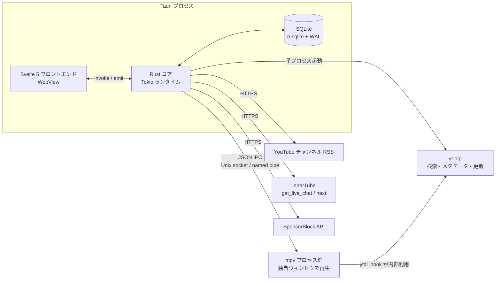
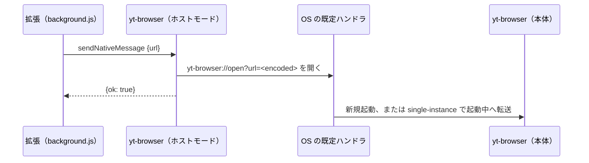

# yt-browser 設計書

[requirements-definition.md](requirements-definition.md) に基づく概要設計と詳細設計。
確定済みの判断は「仕様決定 A」などの ID で [decision-records.md](decision-records.md) を参照する。

## 1. システムアーキテクチャ

### 1.1 全体構成



要点は「動画再生と UI の分離」にある。
mpv は独自ウィンドウで再生し、Rust コアは IPC で操縦だけを担う（仕様決定 B）。
WebView の描画パイプラインに動画を通さないため、WebKitGTK の GL 統合やプラットフォーム差に左右されない。

### 1.2 プロセスとタスクのモデル

- **WebView スレッド**：UI の描画と入力だけを持ち、重い処理は持たせない
- **Tokio ワーカー群**：mpv IPC の読み取りと書き込み、RSS ポーラー、チャットポーラー、yt-dlp 起動をタスクとして動かす
- **DB 接続**：rusqlite は同期 API なので、`Mutex<Connection>` を 1 本持ち、書き込みは短いトランザクションに収める
  書き込み量が少ない用途のため接続プールは持たない。
- **mpv プロセス**：1 再生につき 1 プロセス 1 IPC ソケットとし、マルチビューはインスタンスを増やすだけで済む
- **yt-dlp**：都度起動の短命プロセスとし、常駐させない

## 2. モジュール構成

`src-tauri` 以下の Rust 側を、責務ごとのモジュールに分ける。

| モジュール | 責務 |
|---|---|
| `commands` | Tauri の invoke ハンドラ。入力検証と UI 向けの直列化に徹する |
| `mpv` | プロセス起動、ソケット管理、JSON IPC クライアント、プロパティ監視 |
| `yt` | yt-dlp 子プロセスの呼び出し層。検索、動画情報、チャンネル動画一覧（`YoutubeBackend` トレイト抽象化は現状未導入。§9.2） |
| `feed` | チャンネル RSS のポーラー。新着の検出と未読への積み上げ、新規投入アイテムの shorts 非同期判定 |
| `innertube` | ytcfg の取得と InnerTube への POST。`chat` と `related` が共用する |
| `chat` | get_live_chat ポーラーと renderer → `ChatEvent` への正規化 |
| `filter` | NG フィルタのモデルと、Aho-Corasick / RegexSet によるマッチャ |
| `sponsor` | SponsorBlock API クライアントとスキップ判定 |
| `db` | 接続、マイグレーション、クエリ |
| `model` | `Video`、`ChatEvent`、`FeedItem` などの共通型 |
| `error` | `UiError { code, message }` への直列化と、各エラー型からの変換 |

依存方向は `commands` → 各モジュール → `db` / `model` の一方向に揃え、モジュール間の直接参照を避ける。

## 3. IPC 設計（Tauri コマンドとイベント）

### 3.1 コマンド（フロント → Rust）

| コマンド | 引数 | 戻り値 |
|---|---|---|
| `db_status` | なし | `Result<DbStatus>`（`schema_version`） |
| `settings_get` | `key` | `Result<Option<String>>` |
| `settings_set` | `key`, `value` | `Result<()>` |
| `play_video` | `video_id`, `resume`, `pip?`, `format?`, `start_sec?` | `Result<instance_id>` |
| `player_list` | なし | `Vec<PlayerState>` |
| `player_control` | `instance_id`, `action`（後述の `PlayerAction` 列挙） | `Result<()>` |
| `player_close` | `instance_id` | `Result<()>` |
| `player_set_queue` | `instance_id`, `items`, `loop_all`, `base_seq` | `Result<bool>`（置き換えを適用したか） |
| `history_get` | `video_id` | `Result<Option<WatchHistory>>` |
| `history_list` | `limit?`（既定 500、上限 1000） | `Result<Vec<WatchHistory>>` |
| `history_remove` | `video_id` | `Result<()>` |
| `favorite_add` | `video`（`VideoRef`） | `Result<()>` |
| `favorite_remove` | `video_id` | `Result<()>` |
| `favorite_list` | なし | `Result<Vec<FavoriteEntry>>` |
| `playlist_list` | なし | `Result<Vec<Playlist>>` |
| `playlist_create` | `name` | `Result<Playlist>` |
| `playlist_rename` | `playlist_id`, `name` | `Result<()>` |
| `playlist_delete` | `playlist_id` | `Result<()>` |
| `playlist_items` | `playlist_id` | `Result<Vec<PlaylistEntry>>` |
| `playlist_add` | `playlist_id`, `video`（`VideoRef`） | `Result<()>` |
| `playlist_remove` | `playlist_id`, `video_id` | `Result<()>` |
| `playlist_import` | `url`, `name?` | `Result<Playlist>` |
| `playlist_reorder` | `playlist_id`, `video_ids` | `Result<()>` |
| `playlist_sort` | `playlist_id` | `Result<()>` |
| `playlist_reverse` | `playlist_id` | `Result<()>` |
| `ytdlp_status` | なし | `Result<YtDlpStatus>`（`path` と `version`） |
| `ytdlp_update` | なし | `Result<String>`（`yt-dlp -U` の出力） |
| `subscribe_channel` | `input`（UC ID、channel URL、`@handle` のいずれか）, `category_id?` | `Result<Channel>` |
| `playing_channel` | `video_id` | `Result<PlayingChannel>`（FR-12。videos → watch_history → yt-dlp メタの順に `subscribe_channel` へ渡せる入力と表示名を解決し、UC 確定時は購読済みかも返す） |
| `unsubscribe_channel` | `channel_id` | `Result<()>` |
| `list_channels` | なし | `Result<Vec<Channel>>` |
| `set_channel_category` | `channel_id`, `category_id?` | `Result<()>` |
| `list_categories` | なし | `Result<Vec<Category>>` |
| `create_category` | `name` | `Result<Category>` |
| `list_feed` | `filter`（`unread_only`、`category_id`、`days`、`kind`、全項目省略可） | `Result<Vec<FeedItem>>` |
| `mark_read` | `video_ids?`, `all?` | `Result<u64>`（`all` 指定時は既読化した件数、個別指定時は入力した ID 数） |
| `feed_refresh` | `channel_id?` | `Result<()>` |
| `search` | `query` | `Result<Vec<SearchResult>>` |
| `get_related` | `video_id` | `Result<Vec<SearchResult>>` |
| `block_channel` | `channel_id`, `title` | `Result<()>` |
| `unblock_channel` | `channel_id` | `Result<()>` |
| `blocked_channels` | なし | `Result<Vec<BlockedChannel>>` |
| `chat_start` | `video_id` | `Result<()>` |
| `chat_stop` | `video_id` | `Result<()>` |
| `chat_history_search` | `video_id?`, `query`, `limit?` | `Result<Vec<ChatEvent>>` |
| `filter_add` | `target`, `kind`, `pattern` | `Result<Filter>` |
| `filter_remove` | `id` | `Result<()>` |
| `filter_list` | なし | `Result<Vec<Filter>>` |
| `take_open_urls` | なし | `Result<Vec<{seq, url}>>` |

`play_video` の `video_id` は URL 各形式（`watch?v=`、`youtu.be/`、`/shorts/`、`/live/`、`/embed/`）と裸の動画 ID の両方を受け取り、サーバ側で正規化する。
開始位置の解決順は「`start_sec` 引数の明示指定 > `video_id` が URL ならその `t=`/`start=` パラメータ > `resume` が true なら履歴位置 > 0」。`t=` は `2630s`・`1h2m3s` のような h/m/s 接尾辞と素の秒数を受理する（仕様決定 AF）。
`play_video` が返す `instance_id` が制御対象の識別子で、UI はアクティブな窓の ID を保持して全操作に付ける。
単一再生でも必須引数に揃え、マルチビュー時の操作経路を初期から担保する（FR-1）。
`player_control` に操作を集約するのは、mpv 側への転送層を一箇所に保つためである。
頻繁に増減するイベント型の操作をコマンド名で細分化しない。
表の引数名は Rust 側の受け取り名（snake_case）で記し、JS 側は camelCase のキーで渡す（`video_id` → `videoId`）。
戻り値とイベントのペイロードは camelCase に直列化される。
`action` は `type` をタグとする列挙で、`pause{value}`（`true` が一時停止、`false` が再開）、`seek{seconds}`（絶対位置の秒数）、`volume{value}`（0〜130 の絶対設定）、`speed{value}`（絶対設定）、`quality{format}`（`ytdl-format` 式の変更、変更後は現在位置を保持してリロード）、`frame_step`、`frame_back_step`、`pip{enabled}` を取る。
`player_list` は稼働中インスタンスのスナップショット一覧を返す。
一時停止中は `player://state` が流れないため（§3.2）、ページ再読み込み後のカード復元はこの一覧で行う。
`player_set_queue` は連続再生の武装キューを登録する。`items` は今後再生する動画 ID の順序列（空列は武装の解除）、`loop_all` は取り出し分を末尾へ戻して巡回させるフラグ（仕様決定 AD）。`base_seq` はフロントが計画した時点の取り出し世代（`player://ended` の `armedSeq`）で、指定時は世代が一致するときだけ置き換え、食い違い（その間に別項目を取り出した）では適用せず false を返す。古い置換で消費済み項目が復活する順序ずれを防ぐための束縛で、拒否はエラーではない。
登録済み項目は次の終端（自然終了・途中失敗）で同一 mpv が先頭から読み込む。
`playlist_import` は YouTube プレイリストを `yt-dlp --flat-playlist` で取り込み、
各項目を `video_upsert` で `videos` 台帳に集約したうえで新規プレイリストへ登録する（FR-10、仕様決定 R）。
`url` は YouTube 系ホスト（youtube.com / youtu.be / music.youtube.com）のみ受け付け、
項目登録に失敗したときは作成済みの空プレイリストを削除してからエラーを返す。
`name` 省略時は取り込んだプレイリストのタイトル、それも無いときは「取り込みプレイリスト」とする（暫定）。
`playlist_reorder` は項目順の一括書き換え（FR-11、仕様決定 T）。渡した `video_ids` が
現在の項目と同一集合でない場合は変更せずエラーとする（並行編集の誤適用防止。
検証は `playlist_items` の更新と同じ書き込みトランザクション内で行う）。
`playlist_sort` は `published_at` 昇順の一括ソート（one-shot）。`published_at` の無い項目は末尾に寄せ、同キー内は現在順を保つ。
`playlist_reverse` は項目順の一括反転（one-shot、FR-11、仕様決定 Z）。読み出しと書き込みを同一トランザクションで行い、YouTube が新しい順で返すプレイリストを古い順へ変える用途に使う。
フロント側では一括操作（`playlist_sort`・`playlist_reverse`）の実行中に行の並べ替え保存を開始せず、開始前に飛行中の `playlist_reorder` の確定を待つ。一括操作と個別並べ替えの適用順を「確定した並べ替え → 一括操作」に固定し、結果の反映は項目取得の世代管理で行う（操作後は必ず確定済みの DB 順を再取得して表示する）。
`list_feed` はブロック済みチャンネルをクエリで除外し、返却前に動画系 NG フィルタ（§7 の動画系 target）を後段適用する（FR-9）。
`take_open_urls` は deep link の保留分を取り出す初期ドレイン用で、呼び出し後は `app://open_url` イベント経路のみで届く。戻り値とイベントは `{seq, url}` で、seq は重複除去用の配送識別子（§3.4）。

### 3.2 イベント（Rust → フロント）

| イベント | ペイロード | 発火条件 |
|---|---|---|
| `player://state` | `{ instanceId, videoId, pause, position, duration, fps, state, volume, speed, mediaTitle, pip, format }` | observe_property の変化を間引いて発火[^statesample] |
| `player://ended` | `{ instanceId, videoId, reason, continued, continuedVideoId, armedSeq }` | 終了またはエラー |
| `feed://new_items` | `{ count }` | ポーラーの新着検出、新規購読の初回投入 |
| `feed://kind_updated` | `{ count }` | shorts 非同期判定で `videos.kind` が更新された（一覧の再読込を促す） |
| `feed://status` | `{ channelId?, level, message }` | 取得失敗と復帰 |
| `chat://message` | `Vec<ChatEvent>` | ポーリング応答 1 回分を 1 バッチとして送出 |
| `chat://status` | `{ videoId?, level, message }` | ポーラーの劣化と停止（フィルタ再構築の失敗通知など `videoId` が null の全体通知もある） |
| `sponsor://skipped` | `{ instanceId, videoId, category, segment, action }` | スキップまたは通知（`action` は `"skip"` / `"notify"`） |
| `app://open_url` | `{ seq, url }` | deep link（`yt-browser://open?url=`）の受信（§3.4） |

`player://state` は mpv の `time-pos` 変化をそのまま横流しするとイベント洪水になるため、サンプリングで間引いて送る。

[^statesample]: 実装は 300ms のティックで状態スナップショットを比較して変化時のみ送出するため、一時停止中はイベントが流れず、ページ再読み込み後のカード復元は `player_list` コマンド（§3.1）が補完経路になる。

### 3.3 設定キー

`settings_get` / `settings_set` で読み書きする永続設定のキー一覧。
コード側は `SETTING_*` 定数として保持し、CI でこの表と両方向に照合する（scripts/check_docs_consistency.py）。

| キー | 値の形式 | 内容 |
|---|---|---|
| `quality.format` | `ytdl-format` 式 | 画質。プリセットまたは自由記述のフォーマット式（§4.3） |
| `sponsor.categories` | JSON マップ `{"<カテゴリ>":"<動作>"}` | SponsorBlock のカテゴリごとの動作（§4.4）。動作は `skip` / `notify` / `off` |
| `wheel.volume_delta` | 数値 | ホイール再生中の 1 ノッチあたりの音量変化量（§4.2、mpv script-opts の `wheel-volume_delta`） |
| `pip.geometry` | `WxH±x±y` | PiP 小窓の位置とサイズ（§4.5、既定 `480x270-40-40`） |
| `pip.quality.format` | `ytdl-format` 式 | PiP インスタンスの既定画質（§4.5）。未設定・空文字は `quality.format` に従う（仕様決定 W） |
| `ytdlp.path` | ファイルパス | ユーザー指定の yt-dlp 実行ファイル（§5） |
| `hdr.tone_mapping` | mpv `--tone-mapping` の方式名 | HDR→SDR 変換のトーンマッピング（§4.7、仕様決定 Y）。`auto`/空は未指定として mpv 既定 |
| `hdr.compute_peak` | `yes` / `no` | HDR ピーク輝度のフレーム計測（§4.7、仕様決定 Y）。`auto`/空は未指定として mpv 既定 |
| `mpv.extra_args` | 空白区切りの mpv 引数 | spawn 引数の末尾に追加する汎用受け皿（§4.7、仕様決定 Y）。無効な引数は mpv 起動失敗になる |

### 3.4 外部起動（deep link）と Chrome 拡張（FR-17、仕様決定 AC）

外部からの起動はカスタムスキーム `yt-browser://open?url=<encoded>` で受ける。
受信経路は 2 つあり、どちらも `deep_link.rs` が `app://open_url` イベントへ転送する。

- 未起動での起動: OS が新しいプロセスを立て argv にスキーム URL を渡す。
  `tauri-plugin-deep-link` の `get_current()` で setup 時に拾う
- 起動中での転送: `tauri-plugin-single-instance` が 2 つ目のプロセスを抑制し、
  その argv をコールバックで既存プロセスへ渡す

リスナー登録前に届いた分は `PendingOpenUrls` へ溜め、`take_open_urls`
コマンドの初回ドレインで回収する。フロントは listen 登録の完了後に
drain を呼ぶ（先に drain すると ready が立ち、リスナー不在の間に届いた
URL がイベントだけでは届かず失われる）。ドレインで `ready` が立ち以後は
イベント経路のみを使う。ready 判定とバッファ挿入は同じ Mutex 内で行い、
切替中の URL 損失を防ぐ。各配送には `seq` を振り、保留分とイベントで
同一配送が二度届く場合にフロントが seq で重複除去する（URL ではなく
配送単位で識別するため、同じリンクの再オープンは常に処理される）。
フロント側の振り分け（`deeplink.svelte.ts`）は、動画 URL → `play_video` で
その場で再生、プレイリスト URL → `playlist_import` で取り込み、
`watch`+`list` 複合は動画として扱う。非対応 URL は通知のみで落とさない。

`extension/` の MV3 拡張（ストア未公開、パッケージ化なし読み込み）は
YouTube ページ上のアクション実行とリンク右クリックメニューから起動する。
対象外ページではアクションを無効化し、メニューは YouTube リンク上のみ出る。

#### 3.4.1 Native Messaging ホスト（仕様決定 AH、Phase 23）

Phase 19 の拡張は `yt-browser://open?url=` を非アクティブの新規タブで開いていた。
Chrome の外部アプリ確認はそのタブ上に出るため、利用者は毎回タブを移動して承認する必要があった。
Phase 23 では拡張からの受け渡しを Native Messaging に切り替え、Chrome を経由せずに OS からスキームを開く。



- ホスト名：`io.github.tkg_tamagohan.yt_browser`（Native Messaging のホスト名は英小文字、数字、`_`、`.` に限られるため、識別子のハイフンを `_` に置き換える）
- ホストモードの判定：`main.rs` で、Chrome がホスト起動時に渡す引数 `chrome-extension://<ID>/` を検出したら `run()` を呼ばずにホスト処理へ分岐する。
  Windows では `--parent-window=<hwnd>` も渡されるが使わない。
  Tauri の Builder を組む前に分岐するため、single-instance や deep link の初期化は走らない
- 通信：標準入出力で、4 バイトのネイティブエンディアン長と UTF-8 JSON の組を 1 往復だけ行う。
  要求は `{"url": "<対象 URL>"}`、応答は `{"ok": true}` か `{"ok": false, "error": "<コード>"}` とする。
  エラーコードは `invalid_message`（長さ付き JSON として読めない、または `url` が文字列でない）、`invalid_url`（http(s) の URL でない）、`open_failed`（OS の既定ハンドラで開けない）の 3 種で、受け取る要求の長さは 64KiB までとする。
  ホストは `url` が http(s) の URL として解析できることだけを確かめ、動画とプレイリストの振り分けは従来どおり本体の `deeplink.svelte.ts` が行う
- 起動：ホストは `yt-browser://open?url=<encoded>` を OS の既定ハンドラで開く（Windows は ShellExecute 相当、Linux は xdg-open 相当）。
  既存の deep link 受信経路（未起動なら `get_current()`、起動中なら single-instance）をそのまま通るので、本体側の受信処理は変えない
- 登録：本体の setup で毎回、ホスト定義 JSON を書き、内容が同じなら書き換えない。
  JSON の `path` は実行中のバイナリの絶対パスとし、AppImage では `$APPIMAGE` を使う（マウント先の一時パスを登録しないため）。
  `allowed_origins` は拡張の固定 ID（`manifest.json` の `key` で固定する）の `chrome-extension://<ID>/` とする。
  登録の失敗は警告ログに留め、起動は止めない
  - Windows：JSON をアプリデータ配下の `native-messaging/<ホスト名>.json` に置き、`HKCU\Software\Google\Chrome\NativeMessagingHosts\<ホスト名>` の既定値にそのパスを書く
  - Linux：`~/.config/google-chrome/NativeMessagingHosts/<ホスト名>.json` に書く（`XDG_CONFIG_HOME` があればその配下）
  - 開発ビルド（`pnpm tauri dev`）も同じ処理で登録するため、最後に起動したバイナリのパスが有効になる
- 拡張側：`nativeMessaging` 権限を足し、`sendNativeMessage` の応答で分岐する。
  `chrome.runtime.lastError`（ホスト未登録など）か `ok: false` のときは、従来のスキーム方式でタブを**アクティブ**で開いてフォールバックし、バッジ `!` とツールチップに理由を出す。
  成功時はバッジを消す

## 4. 動画再生サブシステム

### 4.1 mpv の起動と制御

mpv を子プロセスとして起動し、`--input-ipc-server` でソケットを開かせる。
ソケットは Linux が Unix ドメインソケット、Windows が名前付きパイプになる。

```text
mpv --idle=yes
    --input-ipc-server=<runtime_dir>/mpv-<instance>.sock
    --ytdl=yes
    --ytdl-format=<設定値>
    --hr-seek=yes
    --cache=yes
    --hwdec=auto-safe
    --keep-open=yes
    --script=<app_data>/mpv/wheel.lua
    --script-opts=ytdl_hook-ytdl_path=<yt-dlp のパス>,wheel-volume_delta=<設定値>
```

Windows の `--input-ipc-server` は `\\.\pipe\yt-browser-mpv-<instance>-<pid>`（名前付きパイプ、アプリ多重起動の衝突回避にプロセス ID を含める）を渡す。名前付きパイプはファイルシステムに実体を持たないため、出現待ちは `Path::exists` ではなく接続プローブで判定する。

`ytdl_path` を明示するのは、同梱 yt-dlp とシステム yt-dlp が混在する環境でどちらが使われるかを確定させるためである。
`wheel-volume_delta` も同じ `--script-opts` の値に併合される。
mpv のリスト型オプションは同じ指定を重ねると後が前を上書きするため、全エントリを 1 つのカンマ区切り値にまとめて渡す（設定キーは `wheel.volume_delta`、§4.2）。

送受信の例。

```json
{"command": ["loadfile", "https://www.youtube.com/watch?v=XXXX", "replace"]}
{"command": ["set_property", "pause", true]}
{"command": ["seek", 30.5, "absolute"]}
{"command": ["frame-step"]}
{"command": ["frame-back-step"]}
{"command": ["observe_property", 1, "time-pos"]}
{"command": ["observe_property", 2, "pause"]}
{"command": ["observe_property", 3, "duration"]}
{"command": ["observe_property", 4, "video-params"]}
```

監視するプロパティは `time-pos`、`duration`、`pause`、`eof-reached`、`media-title`、`paused-for-cache`、`video-params`（fps 表示用）、`volume`、`speed`。
受信側は 1 ソケットにつき 1 読み取りタスクを持ち、`event` 行を購読者に振り分ける。

### 4.2 コマ送り

`frame-step` と `frame-back-step` はデコード単位の移動なので、秒数換算や fps 推定を伴わず、丸め誤差が原理的に発生しない[^drift]。
逆向き移動は `hr-seek=yes` を前提とし、デコード済みバッファが浅いソースでは最初の 1 回だけ遅延し得る点を仕様として明記する。

ホイールの条件分岐は mpv の input 機構に属するため、アプリ同梱の Lua スクリプトで実装する。

```lua
-- wheel.lua: 一時停止中はコマ送り、再生中は音量（設計書 §4.2 / 仕様決定 D）
-- 音量の変化量は script-opts の wheel-volume_delta（設定キー wheel.volume_delta）で上書きできる
local options = { volume_delta = 2 }
require("mp.options").read_options(options, "wheel")

local function wheel(ev, paused_cmd, playing_delta)
  -- マウスホイールのノッチは複合バインドで press として届く（down が来るバックエンドも一応許容）
  if ev.event ~= "press" and ev.event ~= "down" then return end
  if mp.get_property_bool("pause") then
    mp.command(paused_cmd)
  else
    mp.commandv("add", "volume", playing_delta)
  end
end

mp.add_key_binding("WHEEL_UP",   "yb_wheel_up",   function(e) wheel(e, "frame-step",       options.volume_delta) end, {complex=true})
mp.add_key_binding("WHEEL_DOWN", "yb_wheel_down", function(e) wheel(e, "frame-back-step", -options.volume_delta) end, {complex=true})
```

アプリ側 UI ボタンとキーバインドは `player_control` 経由で同じコマンドを叩く。
割り当ての既定は仕様決定 D、音量の変化量は設定 `wheel.volume_delta` を script-opts の `wheel-volume_delta` として mpv 起動時に注入する[^wheelconf]。
`--script-opts` への注入は起動時に限られるため、設定の変更は次回の再生から有効になり、稼働中のインスタンスには適用されない。

[^drift]: yt-frame-scrub で発生した「`currentTime * fps` の丸めによる着地ずれ」はシークでフレームに寄せる方式固有の問題であり、mpv のコマ送りはデコーダが 1 フレーム進める方式のため推定自体を行わない。
[^wheelconf]: Phase 2 で確定した注入方式で、Lua 側は `mp.options.read_options(options, "wheel")` が起動時に 1 度だけ読むため、スクリプト側での再読み込みや差し替えの経路は持たない。

### 4.3 画質選択

画質は `ytdl-format` の式で表現する。
設定にはプリセットと自由記述の両方を用意する。

| プリセット | 式 |
|---|---|
| 1080p 上限 | `bv*[height<=1080]+ba/b[height<=1080]` |
| 1080p60 優先 | `bv*[height<=1080][fps>30]+ba/bv*[height<=1080]+ba/b[height<=1080]` |
| AV1 優先 | `bv*[vcodec^=av01][height<=1080]+ba/bv*[vcodec^=vp9][height<=1080]+ba/b[height<=1080]` |
| 最高画質 | `bv*+ba/b` |

変更は `set_property ytdl-format` + `loadfile ... replace` で再生中に適用する。

### 4.4 SponsorBlock（技術方針 N）

`GET https://sponsor.ajay.app/api/skipSegments?videoID=<id>&categories=[...]` を再生開始時に取得する。
`time-pos` の監視で現在位置が区間 `[start, end)` に入ったら `seek` で `end` に飛ばし、`sponsor://skipped` を発火する。
スキップはアプリ側の責務に寄せるため、mpv 側の SponsorBlock スクリプトには依存しない。
カテゴリごとの「スキップ / 通知のみ / 無効」は設定で持つ。

### 4.5 PiP とマルチビュー

マルチビューは mpv インスタンスを複数立てるだけで成立する。
PiP は mpv を `--ontop --no-border --geometry=WxH+X+Y` で小窓起動したものを指す。
アプリのウィンドウにはピクセルを持ち込まないので、WebView との合成は発生しない。
`ontop`・`border`・`geometry` はいずれも起動後に `set_property` で変更できるため、稼働中インスタンスを後から PiP 化・解除できる（`player_control` の `pip` アクション、`PlayerState.pip` で状態を伝える）。小窓の位置とサイズは設定 `pip.geometry`（mpv の `WxH±x±y` 形式のみ受理、既定 `480x270-40-40`）で変更する。

起動時の画質式は「`play_video` の `format` 引数（インスタンス別指定）> PiP なら `pip.quality.format` > `quality.format`」の順で解決する（仕様決定 W、実装レベル細目「PiP 画質の解決順」）。稼働中インスタンスの画質はプレイヤーカードの画質選択から `player_control` の `quality` アクションで変えられる。この変更は DB に保存せずセッション内に限り有効で、次回再生は既定画質に戻る（仕様決定 X）。現在の適用値は `PlayerState.format` としてカードへ伝える。

### 4.6 連続再生キュー（FR-10、仕様決定 S）

キューはフロント側のセッション状態（`queue.svelte.ts`）に持つ。
ライブラリの項目から「ここから連続再生」を選ぶと、その項目を通常の `play_video` で起動し、
同時に今後の項目列を `player_set_queue` でバックエンドへ武装する。
mpv が終端（自然終了・途中失敗）を迎えると emitter が武装キューの先頭を取り出し、
同一 mpv で `loadfile` により先頭から読み込む。`--keep-open=yes` 下では EOF 後の mpv が `pause=true` で残るため、読み替え時に `set_property pause false` も送って一時停止を解除する。`player://ended` の `continued` が
true のときフロントはキュー位置を照合するだけで、通常の遷移では再登録しない。
即時の継続は武装キューが将来分をまとめて持つためフロントの再登録を待たない
（再登録が終端に間に合わず継続が途切れる競合の対策、仕様決定 AD）。
モード変更やキュー変化による登録は `baseSeq` に世代を載せて送り、
遷移が挟まって世代ずれで拒否された意図だけを再適用する。拒否応答時に
観測世代が進んでいれば即時に最新意図で再送し、イベント未着なら次の
終端イベント（`armedSeq` の最新世代）で張り直す。
プレイリスト側の編集やキュー位置のずれ（queue drift）は仕様上の制約として許容し、
武装した時点の項目が流れる。
インスタンスの `video_id`・履歴・SponsorBlock 区間は項目ごとに更新される。
履歴は読み込み直後に `history_upsert` で行を確保し、SponsorBlock 区間は
項目ごとに再取得して差し替える。

ループ再生（FR-16、仕様決定 AA）も同じ武装機構で実現する。ループ状態
（なし / プレイリスト全体 / 1 項目）はインスタンスごとにフロントが持ち、
武装対象の選択で表現する。1 項目ループは現在項目を、全体ループは末尾到達で
先頭項目を武装し、キューの無いインスタンスでは全体ループも現在項目の
繰り返しとなる（1 項目ループはキュー中も次へ進まない）。
`player://ended` は継続先の項目を `continuedVideoId` に載せ、フロントは
終了した `videoId` と同一なら現在項目の繰り返し、別項目なら次項目への進行と
区別してキュー位置を同期する。ループが継続している間（`continued` かつ
モードが「なし」以外）は終了トーストを抑制し、イベント自体はキュー進行の
ため発行を続ける。各周回は終端のたびに履歴へ完了が保存され、履歴行は
動画単位のままその都度完了として更新される（周回数の行は増やさない）。

### 4.7 HDR 設定と mpv 追加引数（INV-1、仕様決定 Y）

Windows 実機調査（INV-1）の結論として、mpv 0.41 は既定 `vo=gpu-next` + `gpu-api=auto`
（→d3d11）で DXGI swapchain の色空間書き換えによる HDR 出力経路を自力で張れるため、
Windows Auto HDR へ依存させる設定は不要と判断した。
アプリ側で露出するのは変換方法の指定のみとし、vo / gpu-api / `target-colorspace-hint`
等は設定化せず `mpv.extra_args` の汎用受け皿に任せる。

| 設定キー | 反映先 | 備考 |
|---|---|---|
| `hdr.tone_mapping` | `--tone-mapping=<v>` | 受理集合は `clip` / `mobius` / `reinhard` / `hable` / `gamma` / `linear` / `spline` / `bt.2390` / `bt.2446a` |
| `hdr.compute_peak` | `--hdr-compute-peak=<v>` | 受理は `yes` / `no` のみ |
| `mpv.extra_args` | spawn 引数の末尾へ空白分割で追加 | 無検証の汎用受け皿。末尾配置のため固定引数を上書きできる。`"..."`・`'...'` で空白を含む値を 1 引数にできる（バックスラッシュはエスケープに解釈しない。引用開始は引数先頭または `=` 直後のみで、値の途中の引用符はリテラルとして残る） |

`auto`・空・不正値は未指定として mpv 既定に任せる（`PlayerManager::play` で設定読み出し時に検証）。
いずれも起動時引数のため、変更は次回の再生開始から有効で稼働中インスタンスには即時適用しない。
INV-1 調査は HDR ディスプレイの無い環境で行ったため、HDR パススルー・Auto HDR の介入・
mpv issue #15268（d3d11 が SDR でも HDR swapchain を選びうる既知不具合）の再現は未検証として残る。

## 5. yt-dlp の呼び出し（技術方針 P）

用途はメタデータ取得と検索で、ストリーム解決そのものは mpv の `ytdl_hook` に委譲する。

| 用途 | 呼び出し |
|---|---|
| 動画詳細 | `yt-dlp -J <url>` |
| 検索 | `yt-dlp "ytsearch<N>:<query>" --dump-json --flat-playlist`（行単位の JSONL をストリーム的に読む） |
| チャンネル一覧の補完 | `yt-dlp <channel_url> --flat-playlist --dump-json` |
| プレイリスト取り込み | `yt-dlp <playlist_url> --flat-playlist --dump-single-json` |

運用面の決定を次に置く（Phase 1 確定事項）。

- **解決順**：`settings` の `ytdlp.path`（ユーザー指定）→ 同梱リソースの `yt-dlp` → PATH の `yt-dlp` の順に解決する
- **更新機構**：アプリ内の `ytdlp_update` コマンドが解決済みパスに対して `yt-dlp -U` を実行する
  システム管理のパスでは権限不足で失敗し得るため、失敗時は yt-dlp の出力をそのまま UI に返す。
- **状態表示**：`ytdlp_status` コマンドが解決パスと `--version` の出力を返し、解決不能時は UI に警告を出す
- **JS ランタイム**：yt-dlp の YouTube 解読用に deno を PATH で解決する前提とし、同梱の要否は配布フェーズで再検討する
- **PO Token**：要求される環境では yt-dlp 側の手順（`--cookies-from-browser` や外部プロバイダ）を利用する
  アプリからの伝達経路は後フェーズの課題とし、README に手順へのポインタを置く。
- **失敗の扱い**：タイムアウト、非ゼロ終了、JSON パース失敗を区別して記録し、解析失敗は生の先頭部分をログに残す

## 6. InnerTube クライアントとチャットパイプライン

### 6.1 共有の土台

`innertube` モジュールは watch ページから `INNERTUBE_API_KEY`・`INNERTUBE_CONTEXT_CLIENT_VERSION`・`VISITOR_DATA` を一度だけ取得してキャッシュし、`post_json` を提供する。
このクライアントをチャットポーラーと関連動画取得（`next`）が共用する。

`next` 応答の関連動画は、2026-10 時点の WEB クライアントでは `lockupViewModel`（`contentType == LOCKUP_CONTENT_TYPE_VIDEO`）で返る。
パーサーは旧来の `compactVideoRenderer` / `videoWithContextRenderer` も併せてキー名で再帰探索し、レイアウト差分に耐える。
各フィールドの対応は、`contentId` → 動画 ID、`metadata.lockupMetadataViewModel.title.content` → タイトル、`metadataRows[0]` → チャンネル名、`metadataRows[1]` 先頭 → 短縮表記の再生数、アバター内 `browseEndpoint.browseId` → UC チャンネル ID、サムネイルオーバーレイの `thumbnailBadgeViewModel.text` → 動画長、とする。

### 6.2 チャットポーラー（仕様決定 F）

1. watch ページ HTML の `ytInitialData` から `liveChatRenderer.continuations` の初期継続トークンを得る
2. `POST /youtubei/v1/live_chat/get_live_chat?key=<apiKey>` に `context.client` と継続トークンを渡す
3. 応答の `actions[]` を `ChatEvent` に正規化し、`continuations[0].timeoutMs` だけ待って次を投げる
4. エラー時は指数バックオフ、終了時は継続トークンが消えるためループを抜ける

実装注記（2026-10 の実測値）:
継続エントリは `continuations[]` の各要素が `{<type>ContinuationData: {continuation, timeoutMs?}}` の形で、実応答では `invalidationContinuationData`（timeoutMs=10000）と初期の `reloadContinuationData` が確認できた。パーサーは種別に依らず `continuation` を持つ最初のエントリを採用する。
`timeoutMs` が欠落する場合の下限は 300ms とし、間引きを越えた過剰ポーリングを防ぐ。
アクションは `addChatItemAction.item` の renderer に加え、`replayChatItemAction.actions[]` の入れ子（アーカイブのリプレイチャット）も展開する。
削除アクションのキー名は 2026-10 時点で `removeChatItemAction`（旧名 `markChatItemAsDeletedAction` も併せて受理し、`targetItemId` を対象 ID とする）。

主な renderer の写像は次の通り。

| renderer | ChatEvent.kind |
|---|---|
| `liveChatTextMessageRenderer` | `text` |
| `liveChatPaidMessageRenderer` / `liveChatPaidStickerRenderer` | `superchat` |
| `liveChatMembershipItemRenderer` / `liveChatSponsorshipsGiftPurchaseAnnouncementRenderer` | `membership` |
| `removeChatItemAction` / `markChatItemAsDeletedAction` | `deleted` |
| その他 | `other`（raw_json を保持） |

### 6.3 NG と保存のパイプライン

受信した `ChatEvent` は「NG 判定 → DB 保存 → UI 送信バッファ」の順に流す。
保存は NG に関わらず原文を残し、UI 側の表示だけをフィルタで制御する。
これにより「ログは完全・表示は絞る」専ブラの基本線を保つ。

保存は 1 メッセージごとの `INSERT` を逐次実行せず、ポーリング応答 1 回分を 1 トランザクションで書き込む。
重複除去は二段構えとする。
セッション内では既処理 `item_id` の集合（上限 1 万件、超過分は古い順に破棄）が応答内と処理済みの重複を除き、DB 側では `chat_logs` の `(video_id, item_id)` 一意制約（§8）がセッションを跨ぐ再取得の重複を防ぐ第 2 層になる。

## 7. NG フィルタエンジン（技術方針 M）

フィルタのモデルは `target`（`video_title` / `video_desc` / `channel_title` / `channel_id` / `chat_text` / `chat_author`）× `kind`（`literal` / `regex`）の組み合わせで、評価対象から独立した判定器にする。

- literal はパターン集合を Aho-Corasick で 1 回走査
- regex は `RegexSet` でプリコンパイルし、ヒットした集合だけ個別 `Regex` で詳細を取る
- フィルタ変更時にマッチャ全体を再構築する単純な方式にし、増分更新は行わない

チャンネルブロックはこのエンジンとは別に `blocked_channels` テーブルで扱い、クエリの `NOT IN` と、検索や関連の結果に対する後段フィルタで適用する（仕様決定 E）。

## 8. データベース設計（技術方針 K）

```sql
PRAGMA journal_mode = WAL;
PRAGMA foreign_keys = ON;

CREATE TABLE categories (
  id INTEGER PRIMARY KEY AUTOINCREMENT,
  name TEXT NOT NULL,
  sort_order INTEGER NOT NULL DEFAULT 0
);

CREATE TABLE channels (
  channel_id TEXT PRIMARY KEY,             -- UC... 形式
  title TEXT NOT NULL,
  thumbnail_url TEXT,
  category_id INTEGER REFERENCES categories(id) ON DELETE SET NULL,
  subscribed_at TEXT NOT NULL DEFAULT (datetime('now')),
  last_polled_at TEXT,
  rss_etag TEXT,
  rss_last_modified TEXT
);

CREATE TABLE blocked_channels (
  channel_id TEXT PRIMARY KEY,
  title TEXT NOT NULL,
  created_at TEXT NOT NULL DEFAULT (datetime('now'))
);

CREATE TABLE videos (
  video_id TEXT PRIMARY KEY,
  channel_id TEXT NOT NULL,
  channel_title TEXT,
  title TEXT NOT NULL,
  thumbnail_url TEXT,
  published_at TEXT,
  duration_sec INTEGER,
  kind TEXT NOT NULL DEFAULT 'video'
    CHECK (kind IN ('video','short','live','upcoming')),
  is_read INTEGER NOT NULL DEFAULT 1,      -- フィード由来の新着のみ 0 で入る
  ingested INTEGER NOT NULL DEFAULT 0,     -- 0=ライブラリ由来のプレースホルダ、1=フィード投入済み
  first_seen_at TEXT NOT NULL DEFAULT (datetime('now'))
);

CREATE TABLE watch_history (
  video_id TEXT PRIMARY KEY,
  title TEXT NOT NULL,
  channel_id TEXT,
  channel_title TEXT,
  position_sec INTEGER NOT NULL DEFAULT 0,
  duration_sec INTEGER,
  last_watched_at TEXT NOT NULL DEFAULT (datetime('now')),
  completed INTEGER NOT NULL DEFAULT 0
);

CREATE TABLE favorites (
  video_id TEXT PRIMARY KEY,
  added_at TEXT NOT NULL DEFAULT (datetime('now'))
);

CREATE TABLE playlists (
  id INTEGER PRIMARY KEY AUTOINCREMENT,
  name TEXT NOT NULL,
  sort_order INTEGER NOT NULL DEFAULT 0
);

CREATE TABLE playlist_items (
  playlist_id INTEGER NOT NULL REFERENCES playlists(id) ON DELETE CASCADE,
  video_id TEXT NOT NULL,
  position INTEGER NOT NULL,
  PRIMARY KEY (playlist_id, video_id)
);

CREATE TABLE chat_logs (
  id INTEGER PRIMARY KEY AUTOINCREMENT,
  video_id TEXT NOT NULL,
  posted_at_usec INTEGER NOT NULL,
  author_channel_id TEXT,
  author_name TEXT,
  kind TEXT NOT NULL DEFAULT 'text'
    CHECK (kind IN ('text','superchat','membership','deleted','other')),
  message TEXT NOT NULL,
  amount_display TEXT,
  raw_json TEXT NOT NULL,
  item_id TEXT
);

CREATE VIRTUAL TABLE chat_logs_fts USING fts5(
  message, author_name, content='chat_logs', content_rowid='id',
  tokenize='trigram'
);

CREATE TABLE filters (
  id INTEGER PRIMARY KEY AUTOINCREMENT,
  target TEXT NOT NULL CHECK (target IN
    ('video_title','video_desc','channel_title','channel_id','chat_text','chat_author')),
  kind TEXT NOT NULL CHECK (kind IN ('literal','regex')),
  pattern TEXT NOT NULL,
  enabled INTEGER NOT NULL DEFAULT 1,
  created_at TEXT NOT NULL DEFAULT (datetime('now'))
);

CREATE TABLE settings (
  key TEXT PRIMARY KEY,
  value TEXT NOT NULL
);

CREATE TABLE schema_migrations (
  version INTEGER PRIMARY KEY,
  applied_at TEXT NOT NULL DEFAULT (datetime('now'))
);
```

```sql
CREATE INDEX idx_videos_channel_pub ON videos(channel_id, published_at DESC);
CREATE INDEX idx_videos_unread ON videos(is_read, published_at DESC);
CREATE INDEX idx_history_recent ON watch_history(last_watched_at DESC);
CREATE INDEX idx_chat_video_ts ON chat_logs(video_id, posted_at_usec);
CREATE UNIQUE INDEX idx_chat_item ON chat_logs(video_id, item_id);

CREATE TRIGGER chat_logs_ai AFTER INSERT ON chat_logs BEGIN
  INSERT INTO chat_logs_fts(rowid, message, author_name)
  VALUES (new.id, new.message, new.author_name);
END;
CREATE TRIGGER chat_logs_ad AFTER DELETE ON chat_logs BEGIN
  INSERT INTO chat_logs_fts(chat_logs_fts, rowid, message, author_name)
  VALUES ('delete', old.id, old.message, old.author_name);
END;
```

設計上の注意を四点置く。

- `videos` は購読フィード由来の「未読管理を持つ一覧」と、視聴やお気に入りで登場した動画の双方を載せる最小の台帳とする
  検索や関連の結果は揮発データとして DB に積まない。
  `ingested` は 0 がライブラリ由来のプレースホルダ（フィードには表示せず、初回の RSS 到達で本文を補完する）、1 がフィード投入済みを表す。
  `kind` の shorts は RSS が種別を持たないため、新規投入時に `youtube.com/shorts/<id>` へのリダイレクト非追跡 HEAD で非同期判定して書き戻す（仕様決定 V）。判定失敗は 'video' のまま残し、初版ではリトライしない。
- チャット検索は FTS5 の外部コンテンツ方式で本文と投稿者名を対象にし、削除は `chat_logs` 側の行削除に連動させる
  トークナイザは `trigram` とする。
  `unicode61` では日本語の文が語分割されず部分文字列検索に掛からないためで、代わりに 3 文字未満の検索語が部分一致に掛からない制約を受け入れる。
- `chat_logs.item_id` は InnerTube が振るイベント ID で、`(video_id, item_id)` の一意索引と `INSERT OR IGNORE` で保存を冪等化する
  `item_id` を持たない行は NULL として入り、SQLite が NULL を個別の値として扱うため一意制約の対象外になる。
- 履歴とログの保持は無期限を既定とし、手動削除のみとする（仕様決定 I）

## 9. エラーハンドリングと変更耐性

### 9.1 エラー型の棲み分け（技術方針 L）

モジュールごとに thiserror の enum（`MpvError`、`YtError`、`ChatError`、`DbError` 等）を持ち、`commands` 層で anyhow に畳み込んで UI には `{ code, message }` に直列化して返す。
ポーラー系の長命タスクは anyhow で文脈を積み、連続失敗回数を `feed://status` / `chat://status` の劣化通知に変換する。

### 9.2 YouTube 仕様変更への構造

- ストリーム解決と検索は `yt` モジュール内の関数群（`resolve`・`search` 等）の向こうに隔離し、yt-dlp 実装の破損は更新で追従する（トレイト抽象化は第 2 の実装やテスト差し替えが必要になった時点で導入する。現状は未導入）
- InnerTube の自前実装は `get_live_chat` と `next` に限定し、パーサーは保存した応答 JSON の golden fixture で回帰テストする（技術方針 O）
- 仕様変更時に UI 側が壊れないよう、`chat` / `related` / `feed` の各劣化状態は独立したステータスとして UI に出す

### 9.3 ログ

`tracing` + ローリングファイル出力を標準とし、リリースビルドは INFO、開発は DEBUG を既定にする。
レスポンス原文の保存はデバッグ用途に限定し、継続トークンなど再送可能な値はマスクしてから残す（golden fixture も同様に匿名化する）。

### 9.4 WebKitGTK のヒットずれとプレイヤーカードの常時マウント

GPU なし環境（ソフトウェアレンダリング）の webkit2gtk で、DOM 要素のリマウントをきっかけに入力ヒット領域が描画位置から数十〜160px ずれたまま残る事象が確認された。
ボタンの見えている位置をクリックしても無反応になり、ずれた先の空白領域のクリックが別のボタンに誤爆として届く。
ずれた「終了」領域への誤爆で mpv が終了したり、当時存在した `chat_start` のクラッシュに当たってアプリが abort したりする実害もあった。

リフローを促す系の応急措置（display の再設定、ノードの cloneNode 置換、`translateZ`/`will-change` の付与、zoom、visibility、resize イベント送出、`contain`、pointer-events のトグル）はいずれもヒットマップを再同期させられなかった。
回復は webview の再作成か `location.reload()` に限られ、ずれは長時間運転で蓄積する性質を持つ。
一方で、リマウントされない要素はこのずれの影響を受けないことが確認できたため、対策は「リマウントを起こさない構造」とした。

プレイヤーカードは `src/lib/PlayerCards.svelte` に切り出し、`src/routes/+layout.svelte` で常時マウントする。
トップページ以外では wrapper に CSS の `display:none` を当てて隠すだけで、DOM の取り外しは行わない。
これに伴い、ページの再マウントに乗っていた間接的な処理は明示化した。

- 再生終了後の resumeHint 更新は、`players.svelte.ts` の `playbackHooks` 集合に `+page` がマウント中だけ登録する
- お気に入りとプレイリストの一覧は `page.url.pathname` を見る `$effect` で `/` へ戻るたびに再取得する
  取得結果の採用は発行順の最新のみとし、お気に入りやプレイリストのローカル編集はコミット後に必ず再取得して DB の内容に収束させる

ヒットずれ自体がプラットフォーム側の問題なので、ほかのリマウント要素でも同じ事象は起こり得る。
現行 UI で残る発生源はパネルの開閉やリストの再描画程度であり、今後同じ症状が観測されたら同じ方針（リマウントを避ける常時マウント化）を当てる。

## 10. セキュリティと権限

- WebView は `csp` を既定 `default-src 'self'`、サムネイル表示のために `img-src https://i.ytimg.com https://*.ggpht.com` だけを許可する
- 外部リンクは WebView 内遷移ではなくシステムブラウザに開く
- アカウント連携を持たないため Cookie やトークンの保存は発生しない（仕様決定 H）
- アプリの自動更新は tauri-plugin-updater で `latest.json`（GitHub Releases の `releases/latest/download/latest.json`）を確認する。起動時の自動確認と設定画面の手動確認を併用し、検知時は確認ダイアログ→承認でダウンロード・インストール・再起動する（FR-15、仕様決定 AB）。対象は AppImage と NSIS。更新成果物は minisign で署名し、公開鍵を `tauri.conf.json` の `plugins.updater.pubkey`、秘密鍵を GitHub Secrets（`TAURI_SIGNING_PRIVATE_KEY`）に置く。確認・ダウンロードはネイティブ側で行うため WebView の CSP には影響しない

## 11. リポジトリ構成

```text
yt-browser/
  AGENTS.md / README.md / LICENSE
  docs/
  src-tauri/
    Cargo.toml
    src/
      main.rs
      commands/
      mpv/            # プロセス管理・IPC・プロパティ監視
      yt/             # yt-dlp 呼び出し層（バックエンド差し替え面）
      innertube/      # ytcfg 取得・post_json
      chat/           # get_live_chat ポーラー・正規化
      feed/           # RSS ポーラー
      sponsor/        # SponsorBlock
      filter/         # NG エンジン
      db/             # rusqlite・マイグレーション
      model/
      deep_link.rs    # yt-browser:// スキーム受信・保留バッファ・take_open_urls
      native_host.rs  # Native Messaging のホストモードとホスト定義の自己登録（Phase 23 で追加予定）
      error.rs        # UiError { code, message } への直列化と各エラー型からの変換
    mpv/wheel.lua     # include_str! でバイナリに埋め込む同梱スクリプト
    tests/fixtures/   # golden fixture
  src/                # Svelte 5 + TypeScript（SvelteKit の静的出力）
    routes/           # 各画面（トップ・feed・search・library・settings）
    lib/              # PlayerCards.svelte・パネル描画（ChatPanel.svelte・RelatedPanel.svelte）・VideoActions・行骨格（VideoRow.svelte）・i18n 基盤（i18n.ts）・共有状態と共有関数（players.svelte.ts・chat.svelte.ts・notices.svelte.ts・library.ts）・表示フォーマッタ（format.ts）・行アクション配線（videoActions.svelte.ts）・PiP 設定の UI 側定数（pip.ts）・自動更新の共有状態（updater.svelte.ts）・deep link の解析と振り分け（deeplink.svelte.ts）
  extension/          # MV3 拡張（yt-browser:// を開く launcher。manifest.json + background.js）
  tauri.conf.json
  package.json
```
